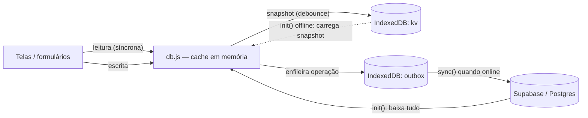
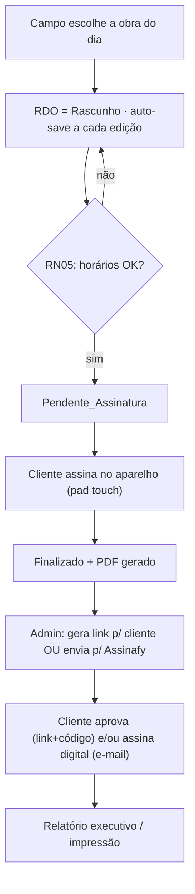
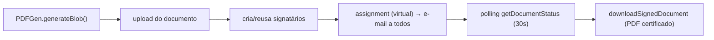

# 🗺️ Canvas — RDO Digital (Modular Service)

> [!abstract] O que é
> Sistema web para **Relatório Diário de Obra (RDO)**: o campo preenche o apontamento hora-a-hora (com fotos e assinatura), o admin gere obras/usuários e acompanha, e o cliente aprova por um link com código. App **estático** (HTML/CSS/JS) com **Supabase** como backend e **modo offline (PWA)** no fluxo de campo.
>
> Notas irmãs: [[STATUS]] (estado atual + changelog). Este canvas é o **mapa de navegação** do projeto.

---

## 1. Stack & princípios

| Item | Detalhe |
|---|---|
| Front-end | HTML estático + JavaScript vanilla (sem framework, sem bundler) |
| CSS | **Tailwind v3** — fonte `assets/css/tailwind.css` → compilado `assets/css/output.css` (`npm run build:css`) |
| Backend | **Supabase** (self-hosted) em `supabase.b2btaxipremium.com.br` — Postgres + Storage |
| Assinatura digital | **Assinafy** via proxy nginx `/assinafy-proxy` (a chave de API é injetada no servidor) |
| PDF | **jsPDF** (auto-hospedado) — replica o template `RDO-001 Rev.03` |
| Offline | **PWA**: Service Worker (app shell) + IndexedDB (cache + fila de sincronização) |
| Auth | Sessão simples em `sessionStorage`; senha em `btoa()` (base64) ⚠️ ver §13 |

> [!tip] Sem etapa de build além do CSS
> Editar HTML/JS é "salvar e recarregar". **Exceção:** ao mexer em `tailwind.css`, rode `npm run build:css`. Nunca edite `output.css` à mão.

---

## 2. Mapa de arquivos

```
index.html                         Login (admin@modular.com / admin123)
sw.js                              Service Worker (PWA) — cache do app shell
tailwind.config.js · package.json  Config de build do CSS
_serve.js                          Servidor estático local p/ dev (node _serve.js)

assets/css/
  tailwind.css   FONTE do CSS  ·  output.css  COMPILADO (carregado nas páginas)
assets/js/
  config.js      SUPABASE_URL + ANON_KEY  (e ASSINAFY_ACCOUNT_ID — ver §11)
  idb.js         Wrapper IndexedDB (stores: kv = snapshot, outbox = fila)
  db.js          Camada de dados OFFLINE-FIRST (cache + outbox + sync)
  auth.js        Login / sessão / requireAuth
  utils.js       Regras de negócio + helpers (datas, slots, badges)
  ui.js          Toast, UIConfirm, dark mode, sidebar, a11y, badge de sync
  assinafy.js    Integração de assinatura digital
  pdf-gen.js     Geração do PDF do RDO
  vendor/        supabase.min.js + jspdf.umd.min.js (auto-hospedados p/ offline)

admin/   dashboard · obras · usuarios · rdo-view · rdo-print · historico · relatorio-executivo · backup
campo/   home · rdo · assinatura
cliente/ ver   (portal de aprovação por token, sem login)
faviconemodular/  ícones + manifest.json
```

Detalhe de cada arquivo no [[STATUS]] e nas seções §8 (telas) e §10 (offline).

---

## 3. Arquitetura de dados (offline-first)



> [!info] Regra de ouro
> **Leituras** são síncronas (do cache em memória). **Escritas** atualizam o cache → salvam snapshot → entram na **outbox** → tentam subir. Sem rede, ficam na fila e sobem ao reconectar (evento `online`, retry 30s e no próximo `init()`).

---

## 4. Modelo de dados (Supabase)

> [!note] IDs são gerados no cliente (`uuid()`), o que permite inserts offline sem conflito.

### `usuarios`
| Campo | Tipo | Obs |
|---|---|---|
| id | uuid (PK) | |
| nome_completo | text | |
| email | text | único (lógico) |
| senha_hash | text | `btoa(senha)` — base64 ⚠️ |
| perfil | text | `ADMIN` \| `USUARIO` |
| funcao_principal | text | Montador, Eletricista… |
| ativo | bool | |

### `obras`
| Campo | Tipo | Obs |
|---|---|---|
| id_obra | uuid (PK) | |
| nome_obra · codigo_of · cliente_nome | text | obrigatórios |
| cliente_contato · endereco_local | text | |
| status_obra | text | `Ativa` \| `Pausada` \| `Concluída` |
| data_cadastro | timestamptz | |
| codigo_cliente | text(6) | código que o cliente digita p/ aprovar |
| emails_signatarios | jsonb | `[{nome,email}]` p/ Assinafy |

### `rdos`
| Grupo | Campos |
|---|---|
| Identificação | id_rdo (PK), id_obra (FK), id_usuario_criador (FK), data_apontamento, dia_semana |
| Status | status_documento = `Rascunho` \| `Pendente_Assinatura` \| `Finalizado` |
| Cabeçalho | executantes, atividade, horario_inicio, horario_almoco, horario_termino |
| Clima | condicao_tempo_manha, condicao_tempo_tarde (`Bom (sem chuva)` \| `Chuva Leve` \| `Chuva Extrema`) |
| Atividade | status_atividade (`Iniciada` \| `Em Andamento` \| `Concluída`) |
| Efetivo | `efetivo{}` = montador, auxiliar, eletricista, soldador, encarregado, tecnico_seguranca |
| Conteúdo | observacoes_desvios, comentarios_fiscalizacao, fotos[] (base64) |
| Assinatura campo | assinatura_cliente_base64, assinatura_nome_confirmacao, data_fechamento |
| Aprovação cliente | cliente_token, aprovacao_cliente, comentario_cliente, nome_aprovador_cliente, data_aprovacao_cliente |
| Assinafy | assinafy_status (`nao_enviado`/`enviado`/`assinado`/`rejeitado`), assinafy_document_id, assinafy_sent_at, assinafy_signed_at |
| Meta | updated_at |

### `rdo_linhas` (apontamento hora-a-hora)
| Campo | Obs |
|---|---|
| id_linha (PK) | |
| id_rdo (FK) | |
| horario_ponto | "HH:00" — chave do slot |
| horario_exato | hora real digitada |
| status_atividade · referencia_modulo · descricao_detalhada | descrição ≥ 20 car. (RN02) |

> Upsert por **`onConflict: (id_rdo, horario_ponto)`** → exige índice/único nessas colunas.

### `obra_usuarios` (N:N)
`id_obra` + `id_usuario` — vínculo equipe↔obra (controlado pelo admin).

### `obra_anexos` (plantas/arquivos)
`id, obra_id, nome, arquivo_url, arquivo_path, arquivo_nome, criado_em` — arquivo físico no **Storage bucket `obra-anexos`** (requer internet).

---

## 5. Papéis & permissões

| Papel | Acesso | Como entra |
|---|---|---|
| **ADMIN** | Todo o `admin/` (CRUD obras/usuários, histórico, relatório, backup, envio p/ assinatura) | login |
| **USUARIO (campo)** | `campo/` — só as obras vinculadas a ele | login |
| **Cliente** | `cliente/ver.html` — só leitura + aprovação | link com `cliente_token` + `codigo_cliente` (6 dígitos) |

`Auth.requireAuth(role)` protege as páginas; sessão em `sessionStorage` (`rdosys_session`).

---

## 6. Ciclo de vida do RDO



---

## 7. Fluxo de uso (passo a passo)

1. **Admin** cadastra obra (`obras.html`) e clica **👥 Equipe** para vincular usuários.
2. **Usuário** loga → vê só suas obras (`campo/home.html`) → preenche RDO hora-a-hora (`campo/rdo.html`) → assina (`campo/assinatura.html`).
3. **Admin** em `rdo-view.html`: "Gerar Link para Cliente" → envia a URL; ou "Enviar para Assinatura Digital" (Assinafy).
4. **Cliente** acessa o link, digita o **código**, lê o RDO e **aprova** (com/sem ressalvas).
5. **Admin** vê aprovação + comentário; **CEO** usa `relatorio-executivo.html` (KPIs do dia, por obra, desvios, ressalvas).

---

## 8. Telas

> [!example]- Admin (`/admin`)
> - **dashboard** — métricas do dia, "quem já fez / o que falta", alertas (RN04), RDOs recentes.
> - **obras** — CRUD de obras + modais: Equipe, Plantas/Anexos, Código do cliente, Signatários (Assinafy).
> - **usuarios** — CRUD com RBAC (perfil ADMIN/USUARIO, função, ativo).
> - **rdo-view** — detalhe do RDO, card de assinatura digital (polling de status), comentário de fiscalização, link p/ cliente, baixar PDF.
> - **rdo-print** — versão fiel ao template `RDO-001 Rev.03` p/ imprimir/PDF do navegador.
> - **historico** — lista com filtros (obra, status, datas).
> - **relatorio-executivo** — relatório do dia (KPIs, resumo por obra, desvios, ressalvas) imprimível.
> - **backup** — exporta/importa JSON e "apagar tudo" (zona de perigo, dupla confirmação).

> [!example]- Campo (`/campo`) — **offline-capable**
> - **home** — saudação + lista das obras vinculadas (status do RDO do dia); plantas.
> - **rdo** — abas Info / Efetivo / Horas / Fotos; auto-save; slots hora-a-hora; RN01/RN02/RN03.
> - **assinatura** — resumo + pad de assinatura touch → Finaliza e gera PDF.

> [!example]- Cliente (`/cliente`)
> - **ver** — gate de código → leitura do RDO → aprovação (Aprovado / Aprovado com ressalvas) + comentário. Sem login.

---

## 9. Regras de negócio

| # | Regra | Onde |
|---|---|---|
| **RN01** | Dados da obra (cliente, OF, local, contato) são puxados automaticamente para o RDO | `campo/rdo.html` `init()` |
| **RN02** | Descrição de cada hora deve ter **≥ 20 caracteres** | `Utils.validateLinha` |
| **RN03** | RDO de data anterior fica **somente-leitura** (edição exige liberação do admin) | `campo/rdo.html` (lock) |
| **RN04** | Dashboard alerta obras **sem apontamento** ("Sem Atividade" à tarde / "Pendente" de manhã) | `admin/dashboard.html` |
| **RN05** | Antes de enviar p/ assinatura: horários início/término preenchidos e **término > início** | `Utils.validateRDOCompleto` |
| **Duplas** | Cada usuário tem **seu próprio RDO** por obra/dia (`getRDOByObraDataUsuario`) | `db.js` / `campo/rdo.html` |

---

## 10. Modo offline (PWA) — fluxo de campo

> [!success] Implementado em 2026-05-29
> Login, listar obras, preencher RDO (hora-a-hora + fotos) e assinar funcionam **sem internet**; tudo sincroniza ao reconectar.

- **`idb.js`** — IndexedDB: `kv` (snapshot do cache) + `outbox` (fila de escritas, autoIncrement → ordem preservada).
- **`db.js`** — offline-first **quando `idb.js` está carregado**. Caso contrário (admin/cliente) → modo online clássico (retrocompatível). API de sync: `DB.sync()`, `DB.onSyncChange()`, `DB.getSyncState()`, `DB.isOnline()`, `DB.getPendingCount()`.
- **`sw.js`** — Service Worker: network-first com fallback de cache; Supabase (API) é ignorado (vai direto à rede). Lib do Supabase e jsPDF **auto-hospedadas** em `vendor/`.
- **`ui.js`** — badge "⚡ Offline · N p/ enviar" / "⟳ Sincronizando…" (some quando tudo sincronizado).
- **Páginas com offline:** `index`, `campo/home`, `campo/rdo`, `campo/assinatura` (carregam `idb.js`, `db.js?v=4`, `vendor/*`, registram o SW).

> [!warning] Requisitos & limites
> - **1ª abertura precisa de internet** (cacheia o app e baixa usuários p/ login offline).
> - **Produção exige HTTPS** (Service Worker + `crypto.randomUUID`). `localhost` conta para teste.
> - **Anexos/plantas (Storage)** ainda exigem internet (tela de admin).
> - Conflitos: **última escrita vence** (`updated_at`).
> - **Teste manual no navegador pendente** (DevTools ▸ Network ▸ Offline) — lógica validada por harness Node.

---

## 11. Integração Assinafy (assinatura digital)

Fluxo (`assinafy.js`) — todas as chamadas passam pelo proxy **`/assinafy-proxy`** (nginx adiciona a API key):



- Disparado em `rdo-view.html` ("Enviar para Assinatura Digital"); signatários vêm de `obra.emails_signatarios`.
- **Config necessária:** `window.ASSINAFY_ACCOUNT_ID` (⚠️ hoje não está em `config.js` — confirmar onde é definido) e o proxy nginx `/assinafy-proxy`.
- Mapeamento de status: `certificated/signed/completed` → **assinado**; `rejected/declined` → **rejeitado**.

> [!note] Diferença entre as duas "assinaturas"
> - **Assinatura no campo** (`campo/assinatura.html`): pad touch, vira imagem base64 no RDO. Funciona offline.
> - **Assinatura digital** (Assinafy): documento certificado por e-mail. Exige internet.

---

## 12. PDF & impressão
- `pdf-gen.js` (jsPDF) gera o PDF replicando o template oficial **RDO-001 Rev.03** (cabeçalho, meta-tabela, hora-a-hora, observações, fiscalização, fotos, assinaturas).
- `admin/rdo-print.html` é a versão HTML fiel p/ imprimir/“Salvar como PDF” do navegador.

---

## 13. Segurança & limitações (atenção)

> [!danger] Pontos a revisar
> - **Senhas em base64 (`btoa`), não hash** — qualquer um que leia a tabela `usuarios` recupera a senha. Migrar p/ hash real (ex.: Supabase Auth ou bcrypt no servidor).
> - **`anon key` e regras**: o cliente lê/escreve direto no Supabase com a anon key → **RLS (Row Level Security)** precisa estar bem configurada no Postgres, senão os dados ficam abertos.
> - **Código do cliente** (6 dígitos) é a única barreira do portal de aprovação — ok para o caso de uso, mas é fraco contra força bruta.
> - **Token de sessão** simples em `sessionStorage` (sem expiração/refresh).

---

## 14. Convenções de UI / CSS
- Tailwind via `@layer components` em `tailwind.css` (`.btn`, `.card`, `.field`, `.modal-*`, `.tbl`, `.sidebar-*`, tags de status…).
- **Dark mode** por classe (`.dark`), persistido em `localStorage`; alternado no `ui.js`. ⚠️ textos com cor fixa de modo claro precisam de variante `dark:` (já corrigido em `home`; demais telas a varrer se necessário).
- **Acessibilidade** (passe de 2026-05-29): labels associados, `aria-label` em botões só-ícone, foco visível, SVGs decorativos `aria-hidden`, modais com foco/Esc, skip links no admin, `safe-area` nas barras fixas do campo. Detalhe no [[STATUS]].

---

## 15. Dev workflow

```bash
# Servir localmente (a partir da raiz — favicons usam /caminho/absoluto)
node _serve.js              # http://localhost:8123/

# Recompilar CSS após editar tailwind.css
npm run build:css           # ou: npm run watch:css
```

> [!info] Deploy (produção)
> Servir os estáticos por **HTTPS** (nginx), com **reverse-proxy `/assinafy-proxy`** para a API do Assinafy (injetando a API key) e o **Supabase** acessível. Sem HTTPS, o modo offline (Service Worker) não ativa.

---

## 16. Backlog / próximos passos

- [ ] **Teste manual offline no navegador** (DevTools ▸ Network ▸ Offline) — campo completo.
- [ ] Migrar **senhas para hash real** e revisar **RLS** no Supabase (§13).
- [ ] Offline para **anexos/plantas** (upload em fila no Storage) — hoje exige internet.
- [ ] Estender **dark mode** às telas que ainda têm texto fixo de modo claro.
- [ ] (Opcional) Virtualizar lista do **histórico** (>50) e refletir **filtros/abas na URL** (deep-link).
- [ ] Confirmar onde `ASSINAFY_ACCOUNT_ID` é definido (§11).

---

## 17. Relacionados
- [[STATUS]] — estado atual, changelog detalhado e instruções rápidas.
- Login demo: `admin@modular.com` / `admin123` (admin criado automaticamente no `init()` se não existir).
